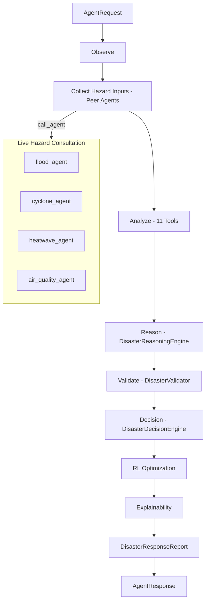

# Disaster Response Workflow

> **Version:** 0.3.0 | **Last Updated:** 2026-07-09

```mermaid
flowchart TB
    REQ[AgentRequest] --> OBS[Observe]
    OBS --> HAZ[Collect Hazard Inputs - Peer Agents]
    HAZ --> ANA[Analyze - 11 Tools]
    ANA --> REA[Reason - DisasterReasoningEngine]
    REA --> VAL[Validate - DisasterValidator]
    VAL --> DEC[Decision - DisasterDecisionEngine]
    DEC --> RL[RL Optimization]
    RL --> XAI[Explainability]
    XAI --> RPT[DisasterResponseReport]
    RPT --> RES[AgentResponse]

    subgraph Peers["Live Hazard Consultation"]
        FA[flood_agent]
        CY[cyclone_agent]
        HA[heatwave_agent]
        AQ[air_quality_agent]
    end

    HAZ -->|call_agent| Peers
```
