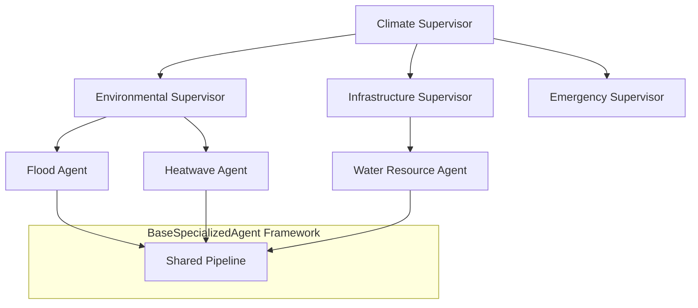
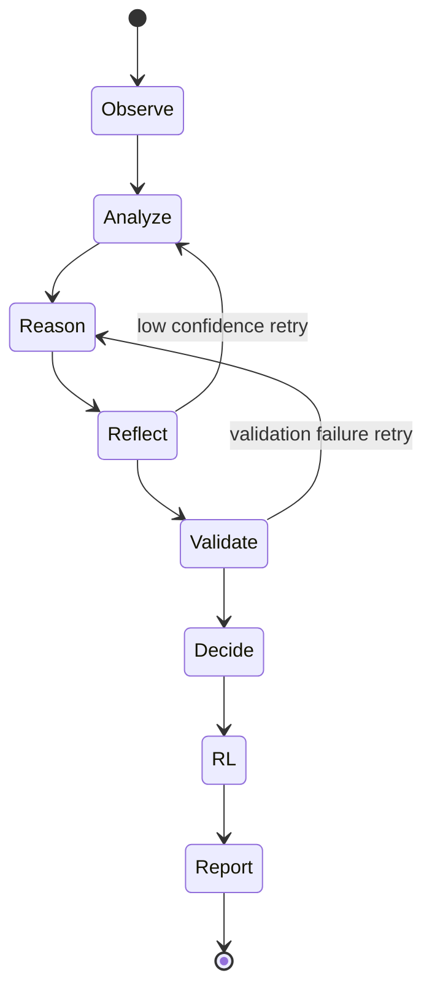
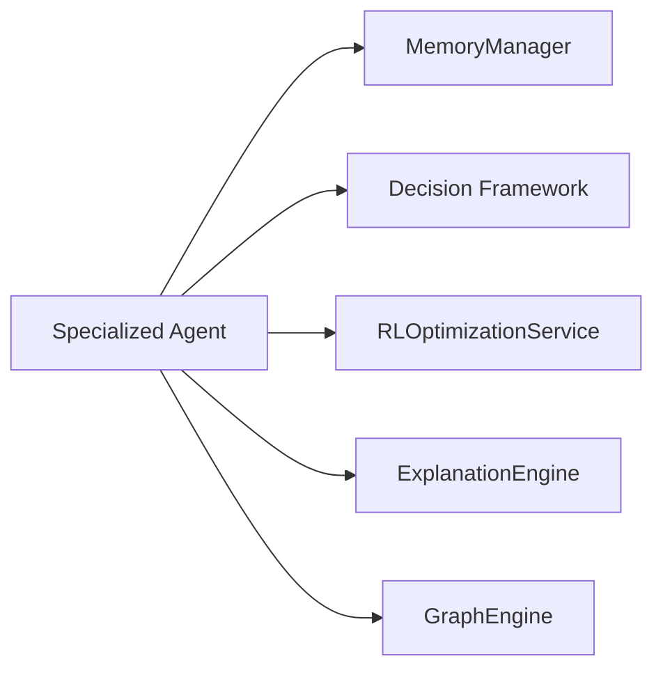

# Specialized Agent Architecture Diagram

> **Version:** 0.2.0  
> **Last Updated:** 2026-07-07

---

## Hierarchical Placement

```mermaid
flowchart TB
    CS[Climate Supervisor]
    ES[Environmental Supervisor]
    IS[Infrastructure Supervisor]
    EM[Emergency Supervisor]

    CS --> ES
    CS --> IS
    CS --> EM

    ES --> FA[Flood Agent]
    ES --> HA[Heatwave Agent]
    IS --> WA[Water Resource Agent]

    subgraph Framework["BaseSpecializedAgent Framework"]
        BSA[Shared Pipeline]
    end

    FA --> BSA
    WA --> BSA
    HA --> BSA
```

---

## Internal Pipeline

```mermaid
stateDiagram-v2
    [*] --> Observe
    Observe --> Analyze
    Analyze --> Reason
    Reason --> Reflect
    Reflect --> Validate
    Validate --> Decide
    Decide --> RL
    RL --> Report
    Report --> [*]

    Reflect --> Analyze: low confidence retry
    Validate --> Reason: validation failure retry
```

---

## Cross-Cutting Services

```mermaid
flowchart LR
    SA[Specialized Agent] --> MM[MemoryManager]
    SA --> DF[Decision Framework]
    SA --> RL[RLOptimizationService]
    SA --> XAI[ExplanationEngine]
    SA --> CKG[GraphEngine]
```
